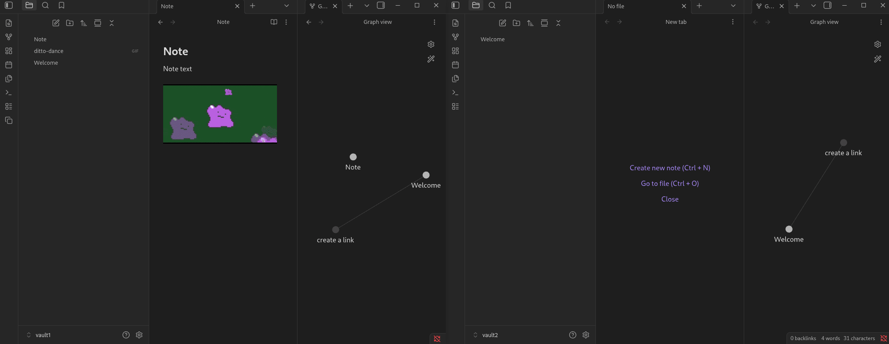

# Copy Notes to Vault

An [Obsidian](https://obsidian.md) plugin that lets you copy notes from your current vault to another vault, including all referenced attachments (images, PDFs, videos, and other embedded files).



## Features

- Browse and select notes via a searchable, folder-tree GUI
- Automatically resolves and copies attachments referenced in selected notes (`![[...]]` embeds and `[[...]]` links)
- Preserves the source folder hierarchy in the destination vault (optional)
- Native folder picker for choosing the destination vault
- Persists your last-used destination and preferences across sessions

## Requirements

- Obsidian desktop (Windows, macOS, Linux) — the plugin uses the local filesystem and is not compatible with Obsidian Mobile

## Installation

### Manual

1. Build the plugin (see [Development](#development)) or download `main.js`, `manifest.json`, and `styles.css` from the [latest release](../../releases/latest).
2. Copy those three files into your vault's plugin folder:
   ```
   <vault>/.obsidian/plugins/copy-notes-to-vault/
   ```
3. In Obsidian, go to **Settings → Community Plugins**, disable Safe Mode if prompted, and enable **Copy Notes to Vault**.

## Usage

1. Click the **Copy** ribbon icon, or open the command palette and run **Copy notes to another vault**.
2. In the dialog:
   - Use the search bar or expand folders to find and check the notes you want to copy.
   - Toggle **Include attachments** to also copy referenced files.
   - Toggle **Preserve folder structure** to recreate the source directory layout in the destination.
   - Enter the destination vault path or click **Browse…** to pick it with a folder dialog.
3. Click **Copy notes**.

## Settings

Defaults for each option can be configured under **Settings → Copy Notes to Vault**:

| Setting | Description |
|---|---|
| Default destination vault | Pre-fills the destination path in the copy dialog |
| Include attachments by default | Whether to copy referenced attachments by default |
| Preserve folder structure by default | Whether to recreate folder hierarchy by default |

## Development

```bash
git clone https://github.com/rgomezjnr/copy-notes-to-vault
cd copy-notes-to-vault
npm install

# Watch mode (development)
npm run dev

# Production build
npm run build
```

Copy `main.js`, `manifest.json`, and `styles.css` into your test vault's plugin folder to load the plugin.

## Support

If you find an issue or have any feedback please submit an issue on [GitHub](https://github.com/rgomezjnr/copy-notes-to-vault/issues).

You can also DM me via Twitter/X: [@rgomezjnr](https://x.com/rgomezjnr).

If you would like to show your support donations are greatly appreciated via:

- [GitHub Sponsors](https://github.com/sponsors/rgomezjnr)
- [PayPal](https://paypal.me/rgomezjnr)
- [Venmo](https://account.venmo.com/u/rgomezjnr)
- [Strike](https://strike.me/rgomezjnr)
- Bitcoin: bc1qh46qmztl77d9dl8f6ezswvqdqxcaurrqegca2p

## Author

[Robert Gomez, Jr.](https://github.com/rgomezjnr)

## Source code

https://github.com/rgomezjnr/copy-notes-to-vault

## License

[MIT](LICENSE) © 2026 Robert Gomez, Jr.
